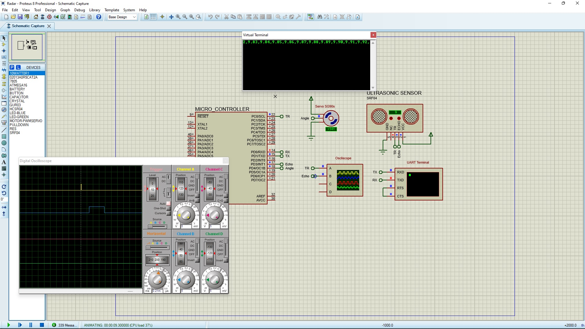
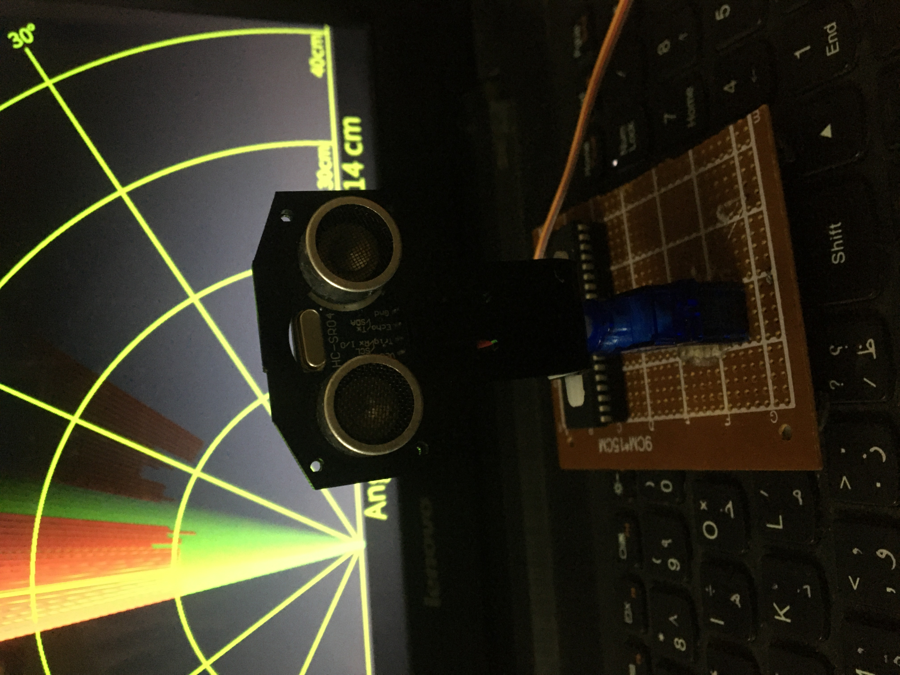

# Radar-System-Project
In this project, I used Atmega16 in addition to an ultrasonic sensor and a servo motor to 
make a radar prototype. The ultrasonic sensor is attached to a servo motor which rotates 160 
degrees. While the servo is rotating, the ultrasonic sensor measures the distance of nearby 
objects. The measured distances are to be displayed on a screen. The angle of the object is 
determined as the angle of the servo when the object is detected. The measured distance and 
its corresponding angle, is sent to Processing program on a PC via UART Communication 
Protocol. The information is displayed in a similar manner of the PPI radar screen.

## Ruselts

The system is adjusted to display objects within a distance of 40 centimeters 
from the radar at angles between 15 and 165 degrees. When there is an object 
within this distance and angle, it is displayed on the screen as red lines at the 
corresponding distance and angle. Otherwise, when there is no object, the 
scanning process is displayed by a moving green line that represents the servo 
angle. The radar is tested by objects at different angles and distances and the 
displayed information's have good accuracy.

## proteus

## Processing screen

